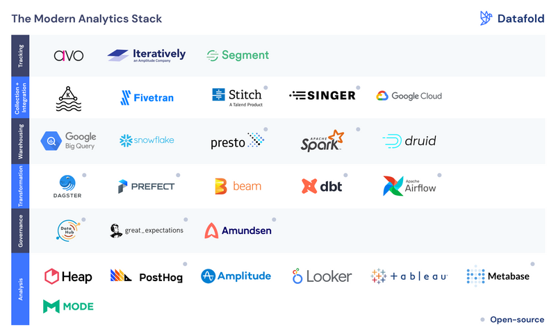

# Modern Analytics Stack

  

> Reference: 
>
> 1.  [Modern Analytics Stack](https://www.datafold.com/blog/modern-analytics-stack)

## Data Value Chain

data process: 

1. Specifcation : defining what to track
2. Instrumentation: registering events in your code
3. Collection: ingesting & processing events
4. Integration: adding data from various sources
5. Data Warehousing: storing, processing and serving data
6. Transformation: preparing data for end users.
7. Quality Assurance: bad data = bad decisions
8. Data discovery: finding the right data asset for the problem. 
9. Analysis: creating the narrative
10. Observability: monitoring data assets, pipelines & infrastructure

