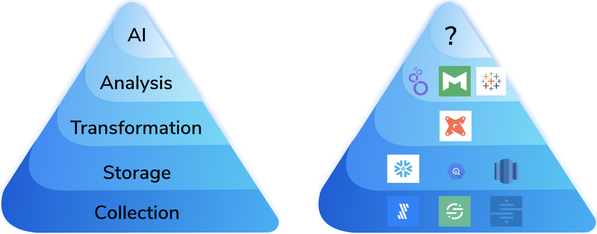

# Modern Data Stack V2

In this current time of growth in the modern data stack, I believe there are five key areas ripe for innovation: 

* Artificial Intelligence 
* Data Sharing
* Data Governance
* Streaming
* Application Serving

## Artificial Intelligence

If a company doesn’t have a solid story for how they are collecting, storing, and modifying data, any data science project is doomed before it starts because the foundations upon which it rests is rapidly shifting. 

  

> Reference Articles
>
> 1. [Emerging Architectures for Modern Data Infrastructure](https://future.a16z.com/emerging-architectures-modern-data-infrastructure)

Data-first systems prioritize automation and operationalization of AI, drastically reducing the time it takes to build and maintain new use cases, and push them into production. 

## Data Sharing (Data-as-a-Service)

provide an invaluable service to customers that allow users to easily and quickly move data out of their cloud data warehouse and into downstream applications that need it. For a lot of use cases, this is essential, and, without purpose-built tooling, companies would be stuck writing custom integration scripts or bespoke tooling that are difficult to maintain and implement. 

Existing Services:

1. [Census](https://docs.getcensus.com/)
2. [Hightouch](https://hightouch.io/docs/)
3. [Snowflake's Data Marketplace](https://www.snowflake.com/data-marketplace/)
4. [Databricks Delta Sharing](https://delta.io/sharing/)

## Data Governance

Without good governance tools, the modern data stack will likely be too chaotic and unwieldy for large enterprises and their behemoth data volumes. Governance imposes order upon an organization’s data and often breaks down natural barriers that can make discovery and collaboration actually possible! 

* Metadata management tool

## Streaming (Real Time)
Someone who can offer a solution where I don’t need to think about infrastructure, move my data into a new platform, and can simply and reliably get live data via a standard SQL query will be greatly celebrated. 

1. Databricks supports [structured streaming](https://spark.apache.org/docs/latest/structured-streaming-programming-guide.html)
2. [KsqlDB](https://ksqldb.io/) -- Kafka-native
3. Snowflake [data pipeline](https://docs.snowflake.com/en/user-guide/data-pipelines-intro.html)

## Application Serving

eventually your data platform is so awesome that people will realize that it contains all the data necessary for the killer application they’ve been writing, and they’ll want to hook up to it. This is generally where our ride comes to a grinding halt. Cloud data warehouses are squarely in the category of OLAP, whereas live applications want something with high concurrency/low latency, which is in the OLTP category. This does not compute. 
