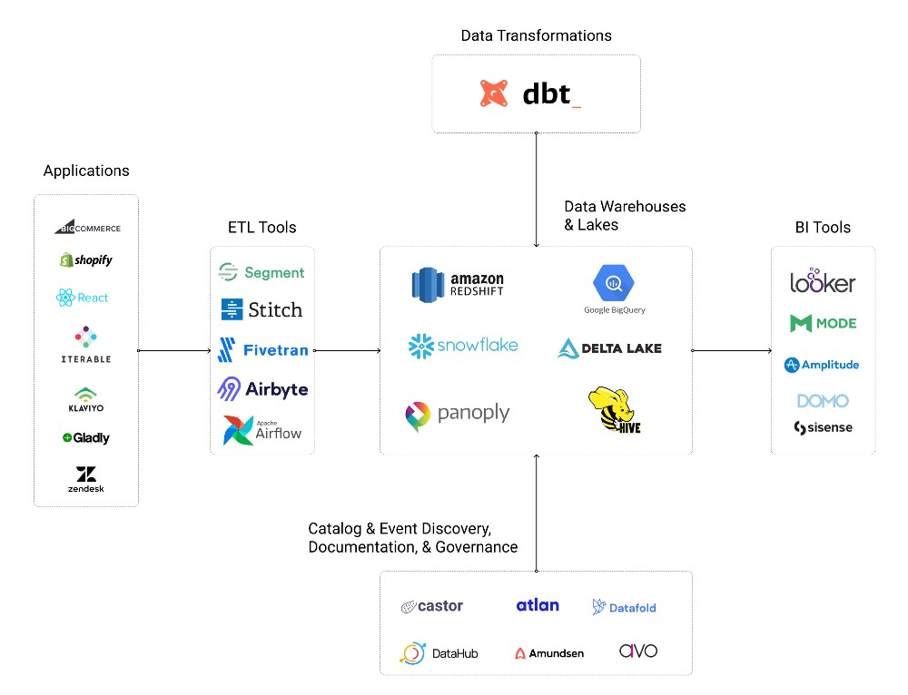

# Modern Data Stack

## What is the Modern Data Stack? 
> Reference Articles:
>
> 1. [The future of modern data stack](https://continual.ai/post/the-future-of-the-modern-data-stack)

**The Modern Data Stack commonly refers to a collection of technologies that comprise a cloud-native data platform, generally leveraged to reduce the complexity in running a traditional data platform. **

### The individual components are not fixed, but they typically include: 

* A Cloud Data Warehouse, such as [Snowflake](https://www.snowflake.com/), [Redshift](https://aws.amazon.com/pm/redshift), [BigQuery](https://cloud.google.com/bigquery), or [Databricks Delta Lake](https://databricks.com/product/delta-lake-on-databricks)
* A Data Integration Service, such as [Fivetran](http://fivetran.com/), [Segment](http://segment.com/), or [Airbyte](http://airbyte.io/)
* A ELT data transformation tool, almost certainly [dbt](https://www.getdbt.com/)
* A BI layer, such as [Looker](https://looker.com/) or [Mode](http://mode.com/) 
* A Reverse ETL tool, such as [Census](http://getcensus.com/) or [Hightouch](http://hightouch.io/) 

### the following as key capabilities of technology in the modern data stack:

* **Offered as a Managed Service**: Requires no or minimal setup and configuration from users and absolutely no engineering required. Users can get started today, and it’s not a vapid marketing promise. 
* **Centered around a Cloud Data Warehouse(CDW)**: Everything “just works” off-the-shelf if companies use a popular CDW. By being opinionated about where your data is, you eliminate messy integrations and tools play well together.  
* **Democratizes data via a SQL-Centric Ecosystem**:Tools are built for data/analytics engineers and business users. These users often know the most about a company’s data, so it makes sense to try to upskill them by giving them tools that speak their language.  
* **Elastic Workloads**: Pay for what you use. Scale up instantly to handle large workloads. Money is the only scale limitation in the modern cloud. 
* **Focus on Operational Workflows(Automation)**: Point-and-click tools are nice for low-tech users, but it’s all kind of meaningless if there’s not a viable path to production. Modern data stack tools are often built with automation as a core competency. 

## Popular components in Modern Data Stack 
> Reference Articles:
>
> 1. [The Modern data stack an overview](https://medium.com/weareinclined/the-modern-data-stack-an-overview-7f4fcfb58355)
> 2. [THe Modern Data Stack: Open Source Edition](https://www.datafold.com/blog/the-modern-data-stack-open-source-edition)

  

### ETL (Extrac, Transform, Load) Tools

* [Segment](https://segment.com/)
* [Stitch](https://www.stitchdata.com/)
* [FiveTran](https://www.fivetran.com/)
* [AirByte](https://airbyte.com/) (Open Source)
* [Apache Airflow](https://airflow.apache.org/) (Open Source)

### Data Warehouses, Lakes & Lakehouses:
* Amazon [RedShift](https://aws.amazon.com/pm/redshift/)
* Google [BigQuery](https://cloud.google.com/bigquery)
* [Snowflak](https://www.snowflake.com/)
* [Panoply](https://panoply.io/)
* [Delta Lake](https://databricks.com/product/delta-lake-on-databricks) on Databricks
* [Apache Hive](https://hive.apache.org/)

### Graph Databases & Analysis
* [Neo4j](https://neo4j.com/)
* [Amazon Neptune](https://aws.amazon.com/neptune/)

### Customer Data Platforms
* [Segment Personas](https://segment.com/)
* [mparticle](https://www.mparticle.com/)
* [RudderStack](https://rudderstack.com/) (Open Source)

### Data Transformation Tools
* [Data Build Tools](https://www.getdbt.com/) (DBT)

### Business Intelligence (BI) Tools
* [Looker](https://looker.com/)
* [Mode Analytics](https://mode.com/)
* [Amplitude](https://amplitude.com/)

### Data Catalog & Event Discovery, Documentation, & Governance Tools ( metadata management)
* [Castor](https://www.castordoc.com/)
* [Atlan](https://atlan.com/)
* [Datafold](https://www.datafold.com/)
* [Avo App](https://www.avo.app/)
* [DataHub](https://datahubproject.io/) ( Open Source)
* [Amundsen](https://www.amundsen.io/amundsen/) ( Open Source)
* [Superset](https://superset.apache.org/) (Open Source)
* [Marquez](https://marquezproject.github.io/marquez/) (Open Source)
* [OpenLineage](https://openlineage.io/) (Open Framework)

### Data Pipeline tools
* [argo](https://argoproj.github.io/) (Open Source)