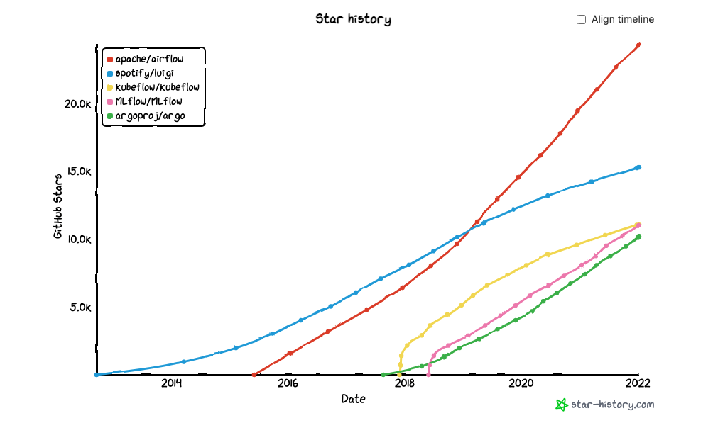
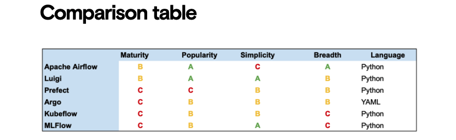

# Task Orchestration Tools and Workflow

Recently there’s been an explosion of new tools for orchestrating task- and data workflows (sometimes referred to as “MLOps”). The quantity of these tools can make it hard to choose which ones to use and to understand how they overlap, so we decided to compare some of the most popular ones head to head. 

Overall **Apache Airflow** is both the most popular tool and also the one with the broadest range of features, but Luigi is a similar tool that’s simpler to get started with. **Argo** is the one teams often turn to when they’re already using Kubernetes, and **Kubeflow** and **MLFlow** serve more niche requirements related to deploying machine learning models and tracking experiments.

  

## What is Task orchestration and why is it useful?

Workflow orchestration tools allow you to define **DAGs -- Directed Acyclic Graph** by specifying all of your tasks and how they depend on each other. The tool then executes these tasks on schedule, in the correct order, retrying any that fail before running the next ones. It also monitors the progress and notifies your team when failures happen.

Overall, the focus of any orchestration tool is ensuring **centralized**, **repeatable**, **reproducible**, and **efficient** workflows: a virtual command center for all of your automated tasks.

## Which to use -- Comparison

You should probably use:

* **Apache Airflow** if you want the most full-featured, mature tool and you can dedicate time to learning how it works, setting it up, and maintaining it.
* **Luigi** if you need something with an easier learning curve than Airflow. It has fewer features, but it’s easier to get off the ground.
* **Prefect** if you want something that’s very familiar to Python programmers and stays out of your way as much as possible.
* **Argo** if you’re already deeply invested in the Kubernetes ecosystem and want to manage all of your tasks as pods, defining them in YAML instead of Python.
* **KubeFlow** if you want to use Kubernetes but still define your tasks with Python instead of YAML. You can also read about our experiences using Kubeflow and why we decided to drop it for our projects at Kubeflow: Not ready for production.
* **MLFlow** if you care more about tracking experiments or tracking and deploying models using MLFlow’s predefined patterns than about finding a tool that can adapt to your existing custom workflows.

  

For a quick overview, we’ve compared the libraries when it comes to: 

* **Maturity**: based on the age of the project and the number of fixes and commits;
* **Popularity**: based on adoption and GitHub stars;
* **Simplicity**: based on ease of onboarding and adoption;
* **Breadth**: based on how specialized vs. how adaptable each project is;
* **Language**: based on the primary way you interact with the tool.

These are not rigorous or scientific benchmarks, but they’re intended to give you a quick overview of how the tools overlap and how they differ from each other. 

> Reference Article:
>
> 1. [Workflow Comparision](https://www.datarevenue.com/en-blog/airflow-vs-luigi-vs-argo-vs-mlflow-vs-kubeflow)
> 2. [Kubeflow: Not ready for production?](https://www.datarevenue.com/en-blog/kubeflow-not-ready-for-production)